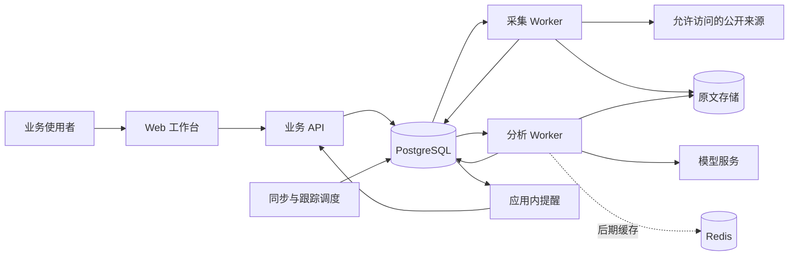

# 04｜系统架构：边界明确，逐步建设

状态：Proposed。以下是目标结构，不是当前仓库已有代码目录。

## 1. 架构原则与替代方案

选择模块化单体作为起点：一个 Python 代码库，不等于所有工作放在一个请求线程；API、采集和分析任务分别运行，但共享明确的领域和应用逻辑。

| 方案 | 优点 | 代价 | 建议 |
| --- | --- | --- | --- |
| 单脚本/Notebook | 快速检查来源和字段 | 任务、权限和持续跟踪弱 | 仅用于经授权的有限验证 |
| 模块化单体 + Worker | 能覆盖业务与可靠性，单人可逐层掌握 | 需要守住模块边界 | 首选提案 |
| 大量微服务 | 可独立扩缩和团队分工 | 网络故障、部署、契约和运维显著增加 | 无当前证据支持 |
| 全托管 Agent 平台 | 减少部分基础设施工作 | 可能遮蔽需要本人学习的状态与可靠性逻辑 | 仅比较，不作为默认依赖 |

## 2. 系统边界图



图中数据库到 Worker 的箭头表示领取持久任务，不是数据库主动调用应用。调度器可以先作为现有进程中的定时入口，不需要先建一个调度微服务。外部附件请求只走受控采集器，不由模型随意访问 URL。

## 3. 模块职责与写入所有权

| 模块 | 负责 | 不负责 |
| --- | --- | --- |
| identity | 服务端身份、工作空间、角色与授权范围 | 从模型输出相信 tenant_id |
| ingestion | 来源连接器、同步进度、原始制品登记 | 企业私有匹配结论 |
| catalog | 公告、程序、标段、版本、状态投影 | 猜测参与资格 |
| documents | 安全解析、证据定位、索引版本 | 执行文档中的指令 |
| profiles | 用户确认的能力、偏好、版本与修改 | 用模型推断自动授予资质 |
| matching | 条件状态、排序规则、匹配快照 | 自由网络访问或绕过权限 |
| research | 有限工具编排、图状态、证据整理 | 直接修改业务真相表 |
| tracking | 收藏、变更关联、提醒规则 | 主动联系采购方 |
| jobs | 任务状态、领取、重试、发布与取消 | 认定任何外部调用恰好一次 |

模块写自己的表，通过应用接口请求别的模块执行动作。读取允许通过明确查询接口或只读视图，不需要为了单体内部通信添加 HTTP 服务。

## 4. 依赖方向

```text
HTTP / Worker / CLI 入口
          ↓
应用用例：开始分析、同步、确认档案、收藏、处理变更
          ↓
领域规则：状态、条件、版本、证据与授权不变量
          ↓
接口（存储、来源、模型、时钟、通知）
          ↑
适配器：PostgreSQL、TED、模型 SDK、文件存储、Redis
```

领域规则不导入 FastAPI、模型 SDK 或 LangGraph。先给真正需要替换或测试的边界定义接口，不为每个函数制造抽象层。LangGraph 是编排实现，不是整个业务域。

## 5. 数据与状态的唯一责任

PostgreSQL 是业务状态和已接受任务的事实来源；Redis 缓存可以丢失重建。原文存储保存字节，数据库保存来源和关联，两者不存在假定的跨系统原子事务。

原件先写不可变内容地址，再提交元数据；写库失败可能留下孤立对象，后续按保留策略清理。数据库引用对象之前必须确认对象存在。不能把对象存储成功误报为业务入库成功。

图 checkpoint 管当前分析进度；企业档案、匹配报告和收藏仍由业务模块管理。图状态与业务事务可能不一致，因此发布步骤使用明确幂等键与任务结果记录，恢复时核查，不能把 checkpoint 当业务已提交的证明。

## 6. 两条执行链

**同步链**：领取同步任务 → 请求一页来源 → 保存原件 → 解析或隔离 → 幂等写入公告与版本 → 记录变化事件 → 推进页面/窗口进度。暂不调用模型生成每条公告的长报告。

**分析链**：API 验证身份与输入 → 事务中建立任务 → 返回任务 ID → Worker 领取 → 固定输入版本 → 查询/检索/计算 → 有限 Agent 补证 → 校验 → 事务中发布报告和必要内部事件。

重试需要新的 attempt，但保持同一业务任务身份。用户刷新页面不应重新启动同一笔分析。流式连接只是观察任务，不是任务的所有者；浏览器断开后任务默认继续，显式取消通过持久状态请求。

## 7. 接口草案（待实现前冻结契约）

| 用例 | 建议接口 | 核心约束 |
| --- | --- | --- |
| 查询候选 | GET /opportunities | 游标、过滤条件、范围与新鲜度 |
| 查询证据 | GET /opportunities/{id}/evidence | 服务端权限、标段/版本约束 |
| 启动分析 | POST /analyses | Idempotency-Key；输入版本；202 + task_id |
| 查任务 | GET /tasks/{id} | 跨空间访问不可泄露任务内容 |
| 观察进度 | GET /tasks/{id}/events | SSE 可恢复事件 ID；轮询可替代 |
| 取消 | POST /tasks/{id}/cancel | 幂等；返回实际持久状态 |
| 确认能力 | POST /profiles/{id}/revisions | 乐观并发 expected_version，冲突不覆盖 |
| 跟踪设置 | PUT /watches/{target_id} | 身份来自服务端；重复操作同一结果 |
| 应用内提醒 | GET /notifications | 权限、去重、已读状态 |

这是内部 HTTP 设计，不是已实现接口。错误需区分输入、无权限、缺资料、外部暂不可用、预算耗尽和系统失败；日志用 request_id/task_id 串联，不只打印“出错”。

## 8. 技术选择与后置条件

| 技术 | 建议用途 | 何时进入 |
| --- | --- | --- |
| Python + FastAPI | API 和业务应用 | 开发获批后 |
| PostgreSQL | 结构化数据、任务、证据关联 | 首条真实数据链 |
| SQLAlchemy / Alembic | 候选数据访问与迁移方案 | 技术验证确认兼容后；非冻结选择 |
| LangGraph | 有限图编排和持久状态 | 确定性分析与工具契约先成立 |
| pgvector | 候选语义检索索引 | 有基线与检索评测后 |
| TypeScript + React | 列表、详情、档案、跟踪工作台 | 首个业务展示；不再加第二后端 |
| Redis | 有版本边界的缓存；可选任务唤醒/传输 | 明确收益与故障语义后 |
| Docker + CI | 可重复环境、测试和构建 | 可运行业务之后逐步引入 |
| Kubernetes | API/Worker 分开运行、发布与故障实验 | Compose 业务和恢复验收后 |

版本、模型、云厂商、对象存储产品、队列库都尚未冻结。开工前检查官方兼容性、支持周期和实际预算，不使用 latest 漂移依赖作为可复现依据。

## 9. 未来代码布局提案

```text
src/bidradar/
  api/                  # HTTP/SSE 适配
  workers/              # 任务入口，不复制领域逻辑
  application/          # 跨模块用例及事务边界
  domain/               # 业务规则、值对象、状态转换
  modules/              # ingestion/catalog/documents/profiles/matching/tracking
  adapters/             # 数据源、模型、持久化、文件、缓存
  observability/        # 脱敏日志、指标与追踪
web/                    # 业务工作台
migrations/             # 版本化迁移，待物理模型确认后
 tests/                 # unit/contract/integration/evaluation/e2e
infra/                  # compose/k8s/ci，按里程碑增加
```

上图仅讨论组织方式，当前不创建这些目录；后续可调整分层命名。不要把计划中的完整目录一次性生成为空壳。

## 10. 架构审核焦点

是否有两套任务状态互相竞争？图恢复会不会重复业务写入？新公告是否触发相关而非所有分析？用户资料变化如何使旧报告陈旧？检索结果和缓存如何限制工作空间与版本？离线重放如何与真实模型实验区分？

能用一个真实样本逐项解释后，再进入下一阶段。详见 [领域模型](05-domain-model.md)、[可靠性](07-reliability-security-operations.md) 与 [决策登记](11-decision-register.md)。
