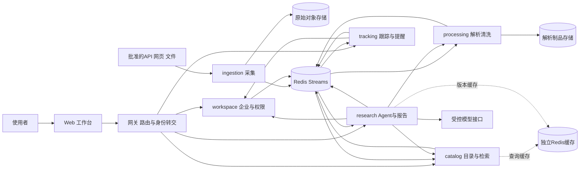

# 04｜微服务架构与数据所有权 v0.2

**Proposed｜2026-09-11。微服务/Redis/K8s 是已确认方向；六服务具体边界待审核。**本页替代 v0.1 的模块化单体与基础设施后置方案。

## 1. 架构目标

按业务责任、独立数据和运行特征拆服务：外部 I/O、危险文件解析、目录检索、私有业务档案、长时模型任务、持续跟踪。能独立构建、部署、扩缩、回滚和测试契约，才算这次微服务目标。

一个 monorepo，六个业务服务；不是六个服务各写一套用户系统，也不拆出无业务责任的万能调度/数据库/模型平台。共享内容限于版本化 API/事件模式、追踪工具和测试设施，禁止共享领域模型或 ORM。

## 2. 系统结构



图不表示所有服务消费所有事件。每条事件的生产者、订阅者和权限见 [契约](14-service-event-contracts.md)。各服务拥有自己的 PostgreSQL 数据库，图为可读性未画出六个数据库。网关只做路由、验证入口身份、限流和请求关联，不掌管跨域事务。

## 3. 六服务边界

| 服务 | 拥有的业务与数据 | 接口/事件 | 独立扩容原因 |
| --- | --- | --- | --- |
| ingestion | source_registry、sync_run/item、raw_asset、抓取策略和源水位 | RawAssetCaptured；受控 fetch 请求；source status | 外部 I/O、每域配额、抓取失败隔离 |
| processing | parse_run、document_version、evidence_span、normalized_observation、quality_issue/quarantine | DocumentNormalized / DocumentQuarantined；证据/规范制品读取 | 文件 CPU/内存、安全与大文档隔离 |
| catalog | 源身份到程序/标段关联、notice_relation、canonical_revision、事实投影和索引 | CatalogRevisionPublished；候选/版本/搜索 API | 查询并发、索引构建和关联处理 |
| workspace | 可信身份映射、workspace/membership、确认的 profile/preference 版本 | ProfileRevisionConfirmed、AccessChanged；鉴权/快照 API | 私有数据和授权独立演进 |
| research | analysis_run/attempt、requirement/finding、checkpoint、冻结输入、报告与费用 | 分析创建/取消/进度；AnalysisCompleted | 长时任务、模型配额、上下文/评测变化 |
| tracking | watch、change cursor、reassessment workflow、notification/read state | AnalysisRequested；提醒和关注 API | 变化扇出、定时和可靠去重 |

processing 的规范字段是某来源的一次观察；catalog 决定有依据的关联及当前业务投影；research 解释和匹配，不能反写公共公告事实。

私有上传文档不是首条链的必要条件。以后接入须明确 processing 的私有制品区、权限和私有索引；不得默认把企业附件放进公共 catalog 检索。

## 4. 持久化和禁止事项

早期开发可使用一个 PostgreSQL 实例提供 ingestion_db、processing_db、catalog_db、workspace_db、research_db、tracking_db，每库独立角色、迁移和备份责任。它们有共同基础设施故障域，不能称独立数据库高可用。

禁止跨服务直连表、跨数据库 JOIN/外键、共享业务事务、一个超级账号操作所有服务。跨域 ID 是契约引用而非物理外键。需要检索联合视图时由事件建立只读投影，带 origin/version/as_of；缺口通过拥有者 API 补齐。

每服务的任务、Outbox、Inbox、事件日志和幂等记录属于该服务，不建一个所有服务任意修改的全局 jobs 表。图 checkpoint 只属于 research，不承担 workspace 的能力事实或 tracking 的关注状态。

原文对象按所有者与可见性分区。先写不可变对象并确认存在，再提交本地元数据和事件；失败可留下孤立对象，按保留策略回收。不存在跨对象存储与数据库的假定原子提交。

## 5. 同步查询与异步命令

**同步 API**用于有界查询、校验权限、获取已发布的不可变版本和接受命令。设置总超时、响应大小、有限重试与错误分类，不形成 ingestion→processing→catalog→research→tracking 的长同步链。

**异步事件**用于数据阶段完成、目录变更、档案变化和分析结果；**异步命令**用于已授权的后台复核。发送的是小型版本引用，不是整份 PDF 或企业档案。命令失败/拒绝有终态回复，不把“已入队”显示为“已完成”。

一次 POST /analyses 由 research 在本地事务保存 run、幂等键和调度 Outbox 后返回 202。浏览器/SSE 只观察任务，不拥有执行；断开后默认继续，显式取消持久化。

## 6. 数据链

1. ingestion 领取本地同步任务，以每源配额访问，保存原件和 raw_asset；本地事务写 RawAssetCaptured。
2. relay 将事件送 Redis；processing 在 Inbox+本地 parse job 同一事务接收，再 ACK 消息。
3. processing Worker 获取受授权原件，解析、清洗或隔离，保存制品与文档版本，在本地事务写 DocumentNormalized/Quarantined。
4. catalog 消费规范观察，按源标识和关联规则建立版本。不能把 partial 隐藏成完整记录。
5. 目录结果先可查询；搜索索引跟进，返回 indexed_revision 与滞后信息，不能把未索引误称没有数据。
6. catalog 发布变化，tracking 独立订阅；research 的失效/状态订阅使用自己的消费组。

每步本地事务，跨步最终一致。原始同步完成、清洗完成、进入目录、被索引、被分析分别有状态，不设置一个误导的全局 done。

## 7. 研究和跟踪链

用户经网关调用 research，research 校验 workspace 权限并固定 profile、catalog、document、规则与配置版本。查询 catalog 和 processing 的已授权证据；模型仅使用有限工具；报告在 research 本地事务发布并生成 AnalysisCompleted。

tracking 收到 CatalogRevisionPublished，针对相关 watch 建复核流程；必要时发布 AnalysisRequested 命令。research 按 watch 授权、输入指纹和幂等键接受/拒绝，返回结果事件。tracking 保存结果关联并在本地事务生成唯一应用内提醒。

不是全局分布式事务。上游成功、下游暂失败时各自状态可查；用重试、重放、对账和必要的业务失效补偿收敛，不撤销已经公开的真实公告。报告不可用时提醒可以先显示“资料更新，分析待完成”，不能假装已重新核查。

## 8. 并发版本与最终一致

每个分析使用不可变 snapshot manifest。新版到达时允许旧任务产生历史报告，但“当前最新”要按当前已知目录、档案和权限重新校验。不能要求六个数据库在同一瞬间原子切换。

事件丢失/延迟时显示 as_of 和 pipeline lag；API 可向 owning service 核查版本。涉及私有资料的返回必须做当前权限校验，授权服务不可用时拒绝或延后，不能依赖旧缓存继续放行。撤权与已在途外部调用无法跨系统原子撤回，需明确风险和最小暴露窗口。

## 9. Redis 的初始角色

redis-core：Streams、消费组及受限的源/模型配额计数，独立内存预算、noeviction、持久化和恢复配置。写入失败应反馈背压，任务留在数据库，不直接跳过限流调用外部服务。

redis-cache：可重建的目录、检索和解析缓存，有 TTL/版本键及淘汰策略。不同实例不是只换一个 logical DB 编号。私有缓存包含 workspace/权限版本，读取仍授权。

业务事实不只在 Redis；重新投递已发送消息靠持久事件日志/消费水位，不能只扫描未 sent 的 Outbox。详见 07 与 14。

## 10. Kubernetes 从首个运行阶段验证

初次部署就为已实现的服务配置独立镜像、Deployment/Service、ServiceAccount、配置/密钥注入、资源、探针、优雅退出、网络规则和日志关联。不是先创建六个空应用占位，也不是直到结尾才学容器网络。

本地集群是基础交付环境；Compose 为快速调试辅助。数据库/Redis 开发单实例与后续受控云环境分别声明，不用单机 Pod 数冒充分布式高可用。负载增加后按 parser CPU、查询延迟、任务积压和模型配额调整副本。

## 11. 代码组织提案

```text
services/
  ingestion/   # 自己的 pyproject、src、tests、migrations、Dockerfile
  processing/
  catalog/
  workspace/
  research/
  tracking/
contracts/     # OpenAPI、事件 schema、兼容性样例；不是共享 ORM
web/           # TypeScript/React 工作台
platform/      # k8s base/overlays、开发辅助、可观测性
quality/       # 数据规则规范、批准样本清单、评测
experiments/   # 故障/负载计划及后续真实报告
```

当前不创建代码目录。每服务独立依赖锁/镜像；公共工具版本化，避免一次共享改动强制六服务一起上线。契约先向后兼容扩展，再迁移消费者，最后移除旧字段。

## 12. 技术取舍

Python/FastAPI 为业务主栈，LangGraph 是 research 候选编排器；PostgreSQL 与 pgvector 位于所属服务；Redis 为明确要求。模型供应商、版本、云与具体网关/认证产品尚未冻结，不自动创建付费服务。

暂不引入服务网格、Kafka、多云、独立向量集群或万能调度中心。原因是暂无具体需求，不是否认项目规模。新增技术需回答解决哪个已测瓶颈、替代什么、怎样验收。

## 13. 架构审核必须回答

每张表谁写？消息丢失如何补回？更新能否单服务发布？同一事件的不同业务订阅者会否互相抢消息？目录回放会否重复提醒？私有报告读取如何撤权？模型限流时 HPA 扩容是否反而增加重试？

这些问题形成 [事件契约](14-service-event-contracts.md)、[可靠性](07-reliability-security-operations.md) 和 [容量计划](15-kubernetes-capacity-plan.md) 的阻断验收。
