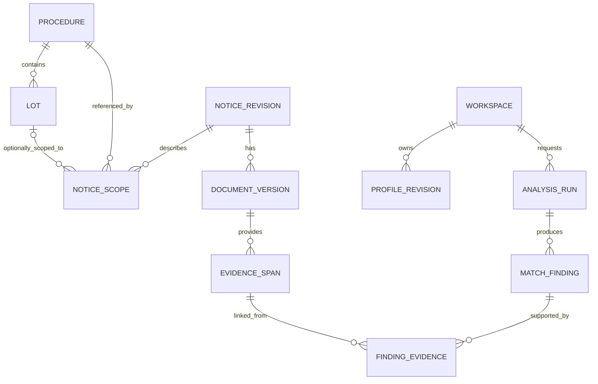

# 05｜领域模型：不要把整个项目塞进一张公告表

状态：Proposed。这里定义内部对象和不变量，不提供已冻结的 SQL 或 TED 字段映射。实际映射必须经过 [G1 数据验证](03-data-foundation.md)。

## 1. 先区分六件东西

**公告**是一次发布；**采购程序**是有依据关联的一项采购过程；**标段**是可能有独立条件的业务单元；**文档版本**是某份内容的具体版本；**商机**是面向某工作空间的判断视图；**分析运行**是基于一组冻结输入执行的一次任务。

一个公告可涉及多个标段，一个程序可有多份不同类别公告。更正可能用新公告引用旧公告，不应强行建成同一行的简单递增版本。不同语言/文件格式也不是不同商机。

内部 lot ID 与来源 lot ID 分开。来源中的局部标段号必须在已确认的程序/来源范围内解释，不能拿诸如 `LOT-0001` 的局部字符串全库合并。

## 2. 概念关系



图为概念模型。尚未关联的公告需有单独待关联记录/状态，不能因图示关系就为它伪造程序。无标段资料时可以做“程序级初筛”，但必须标出分析粒度和未解决范围。

## 3. 建议实体及最小字段

| 实体 | 关键内容 | 约束 |
| --- | --- | --- |
| source_registry | 入口、允许用途、审核时间、抓取策略 | 来源变更可追踪 |
| sync_run / sync_item | 查询窗口、进度、水位、每项结果 | 隔离与失败有计数，不静默跳过 |
| raw_asset | 字节哈希、来源 URL、获取时间、媒体类型、可见性 | 原件不被清洗覆盖 |
| notice_revision | 原生标识、原生版本、发布信息、类型、模式版本 | 组合唯一键经样本确认；内部 ID 独立 |
| notice_relation | 前后公告、关系类型、原文依据、确认状态 | 未确认关系不能驱动合并或覆盖 |
| procedure / lot / notice_scope | 程序、标段、公告涉及范围 | 不按同标题或局部 lot 号直接合并 |
| document_version | 原件、语言、表现形式、解析版本 | 来源版本与解析版本分开 |
| fact / requirement | 值、类型、作用范围、原文位置、解析状态 | 原文事实与模型推断分开 |
| evidence_span | 文档版本、定位器、片段哈希、可见性 | 证据不能只存会变的 URL |
| workspace / membership | 可信身份对应的空间和角色 | 客户端 workspace_id 不等于授权 |
| profile_revision / assertion | 能力、资质、案例、确认者、有效性 | 模型建议不能自动成为确认事实 |
| preference_revision | 地域、语言、交付偏好等 | 可调整偏好不改变官方要求 |
| analysis_run / match_finding | 输入版本、范围、配置、条件状态、结论 | 一个发现可关联多条支持/反证 |
| watch / change_event / notification | 关注、变化、内部提醒、已读 | 发布提醒有业务唯一性 |
| task / attempt | 任务状态、租约、执行代次、取消、结果引用 | 旧 attempt 不得发布新结果 |

这是一份概念清单，不要求第一天创建所有物理表。初次入库只需来源、同步、原件、公告及必要关系；用户/分析/跟踪实体按阶段增加。最终合表/拆表在 G2 决策，不按表数评价架构。

## 4. 字段来源与状态

重要字段建议采用“值 + 原始表达 + 作用范围 + 来源版本 + 确认/解析状态”。例：

```text
内部字段：submission_deadline
原始表达：来源中的日期文本
截止类型：tender_submission / participation / questions / other / unknown
作用范围：明确程序或标段；不清楚则 unknown
时区和精度：源提供的时区、日期/分钟/秒精度
标准值：只有可可靠转换时才存在
来源：document_version + evidence_locator
解析状态：parsed / missing / conflicting / parse_error
```

例子仅是内部契约。不要直接假定 TED 响应使用这些名称或枚举。

金额采用精确数值类型并保留币种、金额含义、期间/税口径和作用范围。跨币种排序没有批准的换算基准时分组展示，不引入模型临时猜测的汇率。

## 5. 匹配结论的结构

每条 `match_finding` 至少含：分析对象、要求 ID、要求作用范围、企业档案版本、条件状态、理由、支持证据、反证、未决项、创建时间与配置版本。

条件状态建议固定为：

| 状态 | 含义 |
| --- | --- |
| met | 在当前证据范围内有依据支持满足该条件 |
| unmet | 条件明确，且已确认能力明确与之不符 |
| unknown | 需求或企业信息缺失/不可取，不能判断 |
| conflicting | 资料相互冲突，尚未解决 |
| not_applicable | 有依据说明该条件不适用于当前分析单元 |

这五种状态不是法律认证；“所有已识别条件 met”也不能证明已识别了全部条件。

硬条件、业务偏好、一般相关性分别存类别。`unmet` 的偏好不自动变成资格不符；`unknown` 的硬条件也不能因较高相关性分数而被遮蔽。

## 6. 时间与版本快照

至少区分来源发布/生效信息、系统首次观察时间、此次抓取时间、解析时间、分析时间。保存源原始表达，不能默认抓取时间代表信息生效时间。

一个分析快照绑定：来源公告集合、原件版本、标段/程序关联版本、企业能力版本、偏好版本、权限范围版本、解析/索引版本、规则/提示词/模型配置标识。模型名称若无法锁定不可变版本，明确保留这项复现限制。

旧报告可回看，但新公告、能力变化或权限撤销后必须检查是否仍可显示，并标为陈旧或拒绝访问；不静默修改旧报告的历史结论。报告分享和导出在每次访问时授权。

## 7. 状态不是一个混合字段

**公告已知业务状态**：是否处于可进一步核查的阶段、已结束/取消/授标或未知，需类型、日期和原文依据共同确定。

**数据处理状态**：待获取、已获取、解析成功、部分解析、不可访问、隔离。资料处理失败不等于项目结束。

**个人跟进状态**：new、reviewing、watching、dismissed、archived；是使用者的工作状态，不改变官方状态。

**分析任务状态**：queued、running、waiting_input、retry_wait、succeeded、partial、failed、cancelled。succeeded 表示约定流程完成，可以合理产生 unknown；不代表条件全部满足。partial 用于部分步骤失败但保留了明确标记的可用产物。

## 8. 唯一性与并发约束

建议唯一性包括：经 G1 确认的来源制品身份；同空间同请求的幂等键；同分析输入指纹的指定版本结果；同用户同分析单元的关注关系；同关注规则版本和变更指纹的应用内提醒。

相同幂等键不同请求体返回冲突，不悄悄重用。用户档案更新采用 expected_version；并发修改不按最后写入无提示覆盖。租约代次和任务取消检查必须参与结果提交事务。

程序/标段关联调整后旧结论标记需复核；不能把原来关联错误的结果直接迁移成新对象的确定结论。

## 9. 权限分区

公共公告可作为共享来源，但私有上传文件、企业档案、反馈、任务、匹配结果、图状态、向量与缓存按工作空间隔离。多来源组合出的报告按最严格的数据可见性处理。

鉴权从服务端身份到 membership 解析；连接池事务内上下文必须可靠设置和清理。若增加 PostgreSQL RLS，需要验证应用角色不绕过策略，且检索和后台任务都带授权范围；不能只勾选启用 RLS 就宣称隔离完成。[S7](12-source-register.md#s7)

## 10. 保留、删除和修订

原文版本追溯不等于无限保留一切。公开来源、用户私有资料、图状态、日志、缓存与备份分别定义保留期；许可变化或用户删除后，从在线索引、派生报告与可访问缓存撤销，并记录备份到期边界。需要保留审计时只保留必要元数据，不以审计为由永远保留敏感正文。

物理模型落地前必须走查：多标段、未知日期、冲突更正、错序导入、能力修正、权限撤销、删除与恢复。这些都是验收案例，不是后期优化项。
