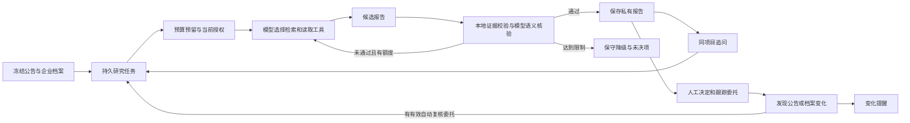

# AGENT-001｜研究 Agent 与持续跟踪

摘要：2026-10-01获授权完成R1/R2，以真实模型工具循环、证据质量与变化复核为核心；DeepSeek V4 Flash测试预算按20元执行；本地开发、542项回归与最终5项有限AI样本独审通过，待负责人统一阅读。

## 本次改变

新目标覆盖R1后半段及R2；基线fc68ef51353623c9dd638eb2219dadea99d79042，独立分支codex/r1-r2-agent。模型使用/测试预算由负责人本轮明确，凭据仓库外保存。范围、接口和验收见[33](../33-agent-research-tracking.md)。

基础接口增加服务身份、档案固定版本/授权代数、所属服务事件流和目录研究包。研究预算账本与可重建业务库分开，预留后才外发，未知费用继续占额；这些工程边界须与真实AI质量分别验收。

四个本地服务、持久任务、研究工具循环、人工决定和持续跟踪界面已连接。最终5个新样本通过有限业务独审；首次真实模型因反复检索触及16次工具上限而降级partial等历史失败保留，不能把调用成功冒充质量通过。

## 阅读顺序

阶段结束统一阅读这三个入口，先沿下方数据流理解，再看测试：

1. `services/research/agent.py::run_agent`：为什么模型选择工具，而权限、次数、核验和发布权由程序掌握。先看SYSTEM与TOOLS，再顺状态机读。
2. `services/research/evidence.py::EvidenceIndex / validate_report / finalize_report`：从固定观察生成引用身份，理解“存在引用”和“引用支持结论”的区别；缺证据时为什么必须unknown。
3. `services/tracking/service.py::consume_event / _queue_reassessment / check_delegation`：变化怎样变成新研究任务，为什么关注、自动复核授权和人工决定分开。

需要深入恢复时再读`research/worker.py::tick`→`ResearchService.guard / ResearchStore.check_lease`→`BudgetLedger.complete / replay`→`ResearchStore.claim / checkpoint / finish`，关注跨恢复的授权、300秒窗口，以及只复用请求精确匹配的已入账响应。不要求先通读全部文件；最终审查还会核对注释和行为。

## 数据流与失败边界

固定档案/公告输入→持久任务与预算→模型选择只读工具→验证引用与未知→私有报告→显式跟踪委托→变化/复核/按类型去重提醒。工具、模型、恢复和发布均检查当前权限，外部内容不得扩权。

读代码时抓住三个问题：模型如何选下一步；程序如何阻止无依据结论和超额调用；变化如何生成新报告而不覆盖旧报告。DeepSeek同时用于研究与语义核验，核验也会漏错，因此实际样本另外接受独立审查。本轮测试不等于真实企业资质认证，模型核验通过也不等于可以投标。

## 最终结构与真实样本（c16e01c）

2026-10-01 03:47–03:59+08，`c16e01c0163636aa820e531eb0ca5806096733b1`整合d80369e。报告待核查缺口questions仅完整复用当前unknown_reason；未核验资格只接受固定保守说明，详细适用分支保留完整原文，程序不替模型补写。追问answer复用当前完整reason；技术/交付理由仍由模型比较企业声明和来源证据。旧Q5/auto2错误原样被新守卫拒绝，候选未改写；版本提升为Agent-v14/提示-v13/证据-v13，旧报告保留旧规则。代价是资格部分不自动生成已核完的材料清单，不能据此确认企业具备资格。

本机8965–8968四个独立进程，Windows/Python3.13.12，真实DeepSeek请求仍为deepseek-v4-flash，实际响应deepseek-flash。以下均是该最终AI代码的新调用，所有任务succeeded/模型核验通过，并由未参与实现的review_source_001逐字段独立审查；这是有限样本通过，不是生产质量保证或负责人本人已验收。

| 用例 / 任务ID | 模型/工具/修订次数 | 峰价估算元 | 独立审查要点 |
| --- | --- | --- | --- |
| gansu-A-v13 / 9b77fb5ae9414a1ca97bad75eb277585 | 6/10/1 | 0.117549 | 甲公司主题相关，未将60日开发期限当成驻场；资格保留unknown |
| gansu-B-v9 / d223529c02534f8ebf9c69fdb1d0b862 | 5/10/0 | 0.120711 | 乙公司明确缺研发团队，对应实际系统开发要求判技术unmet，资格仍unknown |
| ai-compute-a-v8 / 27a1b492e0654fb689c2e2ff7dbddc2b | 6/10/1 | 0.137718 | 服务、试运行、验收动作未改为开发；软件能力不等于具备算力资源 |
| gansu-question-browser-v6 / bc2d3e4370234a049131bb7915959f89 | 5/9/0 | 0.090339 | 实际浏览器追问，拒绝60天驻场不足以判不适合；资格资料尚未核验 |
| gansu-auto-browser-v3 / e006bfac06eb458fb5eae01ad3b5949b | 5/10/0 | 0.104215 | 实际档案第4→5版触发，新的固定输入复核；商务细项仍未全部核完 |

前三项通过`python scripts/evaluate_research_case.py --notice-id <甘肃或算力ID> --case-key <表中名> --execute --wait-seconds 45`，乙公司加`--company 1`，均exit0；CLI成功与质量结论分开记录。全部报告/冻结输入在忽略目录`.bidradar-data/r12-workbench/evaluations/<用例>.json`，浏览器两例另保存checkpoint诊断。报告不因外部独审而修改human_reviewed=false：负责人尚未验收，独审结果独立存放`independent-review.json`。

同冻输入对照`quality-labels-v3.json`含14个独立代理标签，按原文/定位对重复证据ID归组，非负责人gold：甲baseline覆盖7组/预期状态7，Agent覆盖6组/预期状态6，漏文件获取窗口；乙baseline覆盖7组但正确状态6，Agent覆盖7组/预期状态7，新增实际能力缺口识别。两例均不把资格unknown当满足/不满足；基线主要展示原文，Agent能比较能力但不保证覆盖胜过基线。甲另未单列限价/文件费，不能宣传关键条件全覆盖、准确率100%或全自动投标判断。

03:56实际页面开启watch第6版及7天自动委托，虚构甲公司商务档案增加“后续维护边界”，确认正式第5版后形成变化`9d92200213e23b7b5058d625bf79def9`和唯一复核`2aea5fe5428783da535edbf0651965e5`。同一变化change_detected与reassessment_completed各1条；50份既有报告payload SHA256全部不变，新增第51份。证据在`.bidradar-data/verification/reports-before-auto-v3.json`、`reports-after-auto-v3.json`、`final-auto-tracking.json`。03:58前已通过页面停止watch第7版，无自动委托，重启运行器model_enabled=false；截图`final-watch-stopped.png`显示关闭状态，旧8765工作台未动。

本轮含全部历史失败累计39个真实任务、212次供应商尝试，账本峰价计入/预留4.477675元：211次已知usage估算4.319319元，历史一次网络结果未知保留0.158356元；不是供应商实际账单。未知调用保持waiting_input，不自动重发，未删除账本重置预算。最终5例共27次/0.570532元，未增加未知项。完整汇总`final-budget.json`，密钥和账本均仓库外，原始费用响应不进Git。

c16独立research100项/13.235秒退出0，根JS语法与compileall通过。根全量537项28.872秒有1项HTTP早拒绝测试WinError10053；不把这次记为通过。windows_checks在独立树确认共用HTTP/test blob一致，目标测试5次正常通过，但header发出后body延迟20ms可确定复现Host/Forwarded/类型早拒绝与后到body竞态；重复键JSON先读body控制组400。未抓包不声称已证明TCP RST；后续535f2fc已补有界关闭处理及分段发送回归，见下一节。原失败日志保留`checks-c16e01c0-0.txt`，不删除重试历史。

收尾文字澄清：契约中“不会主动采集源站”只消除“不定时”的歧义，未改变R2只消费已导入观察的范围，无新增代码或学习要求。

## 最后工程修复与交付检查

`535f2fc34ec08938c7670db0a4c75a9c5ffeec09`仅修共用HTTP与对应测试，不改AI配置/输入/提示词。拒绝后先完整JSON、Connection:close及半关闭写端，再只丢弃最多min(64KiB,max_bytes)、总250ms；可确定Content-Length按剩余字节，歧义framing不解析、不dispatch。正常请求read1记录已消耗体量并执行总10秒截止，防慢滴答刷新等待；超时仍503。超过清理限额的发送者仍可能中断，不承诺无限恶意body能正常读完响应。

子任务Windows/Python3.12.14于04:01–04:02，独立agent-core工作树d803→8ce：local_http/research_runtime/tracking/workbench_http受影响68项14.265秒通过，最终调大测试调度余量后local_http8项0.957秒通过；差异检查退出0。测试等待响应头事件后再发迟body，九类早拒绝断言实际状态/JSON及无业务dispatch，未豁免10053。根运行器04:02以535重启，model_enabled=false，现有报告/关注状态保留。根于04:03+08、Windows/Python3.13.12/SQLite3.51.1执行`python -X utf8 -m unittest discover -s tests -p test_*.py -v`，542项30.324秒退出0；Node24.11.1执行`node --check services/workspace/web/app.js`及`python -X utf8 -m compileall -q services scripts`均0。命令/cwd/时间/完整SHA/退出码记录在`.bidradar-data/verification/checks-535f2fc3.json`及同前缀日志。未参与实现的review_source_001同版本独立执行`python -B -X utf8 -m unittest discover -s tests -p test_*.py -q`，542项30.278秒退出0，fc68ef→535差异检查0，HTTP阻塞关闭。随后只有文档/索引收尾，最终head独审、提交后基线检查、PR及CI结果以PR运行摘要为准，不为文档写入自身SHA制造循环提交。

04:04实际浏览器在535重启后读取最终auto3报告，仍为第5版当前输入一致；无新模型任务。最终报告截图`final-auto-report.png`、停止委托截图`final-watch-stopped.png`已检查。独审也逐个确认50旧哈希与两类唯一提醒。auto3未逐项回答付款、质保、知识产权及后续维护，不将“复核完成”宣传为全部商务缺口核完。

## 验证与未验证

以下保留按版本发生的验证与修复历史，早期“实施中/未通过”只针对对应旧版本；最终有限样本结果见上方独立章节。基线395项仅证明R1-A；两家虚构企业与有限公开样本不代表真实企业或生产PostgreSQL/RLS。

2026-10-01，本工作树 Windows/Python3.13.12/SQLite3.51.1，基于613f4ca工作树差异：`python -m unittest discover -s tests -p test_catalog_http.py -q` 21项、`test_workbench_http.py` 13项、`test_workspace_store.py` 34项、`test_research_budget.py` 5项均退出0。均本地虚构输入，包含真实回环HTTP；未调用模型。最终提交和全量验证另记。

中途整合d775b4d后全量`python -m unittest discover -s tests -p test_*.py -q` 466项、13.827秒、退出0；此时新运行脚本尚未纳入。独审发现的脱敏键/电话格式P1在8786118关闭，provider11项复验通过。恢复断点、真实事件名称和待人工终态的P2正在修复，未称最终通过。

工程复验（2026-10-01 01:40+08，完整`bb5458357983c15a679169861cfa61c124b22dd0`，Python3.13.12）由未参与实现的review_source_001独立执行runtime15、tracking35、workbench HTTP14、agent21、budget6，共91项退出0；JS语法和增量差异检查通过。原五项P2关闭：已入账响应恢复、ProfileConfirmed事件名、waiting_input终态、报告当前性、内部401不误注销。另核对同时间分页、档案变化+目录离线、撤权与真实注销。此结论只覆盖该SHA工程边界，不代替后续AI质量与最终审查。

真实样本首轮（b7c6a22，2026-10-01，8965–8968本机四独立进程，Python3.13.12）：`python scripts/evaluate_research_case.py --notice-id b8b2c90fb20e1302c4bfc0d065f21fb8b29b9a90602a0a11610eba4f08908ac0 --case-key gansu-ai-a-v1 --execute --wait-seconds 45`退出0。5次供应商调用，任务7.847秒，费用峰价估算0.028956元，无未知费用；Agent结果partial/not_verified，工具16次未形成已核验分析。完整证据位于本工作树忽略目录`.bidradar-data/r12-workbench/evaluations/gansu-ai-a-v1.json`，不发布凭据/账号文件。命令成功不是质量成功。

第二轮同命令仅case-key改`gansu-ai-a-v2`（运行代码cd30a45/8f6f70e），5次模型调用、13次工具、0.088042元；仍partial：否定免责声明被关键词规则误伤、无引用缺口误列要求、交付检索漏掉已存在原句。第三轮`gansu-ai-a-v3`（`eac79de18f80eb11de425d982b28f61db89b97bc`），5次模型/11次工具、0.115375元；分类回退已找回交付片段，但摘要添加机器标识等数字被拒，未通过AI验收。被拒候选另暴露“可能冲突”误用conflicting、把采购分类暗变为行业资质门槛，正在修复。两轮命令退出0，完整失败文件仍在同一evaluations目录，未改写成通过。至第三轮累计15次调用/0.232373元峰价估算/0次费用未知，单次和累计均读取持久账本。

第四轮甲公司`gansu-ai-a-v4`与乙公司`gansu-ai-b-v1`（40b6402591442a5b7a30ceabc6311cd63303cf8f）：均仍partial，分别6次/0.124127元、5次/0.097984元。甲公司已正确区分开发期限、驻场时长与资格未知并进入语义核验，但核验提示未说明schema允许的材料覆盖条目，产生规则不一致；乙公司把64位引用ID漏写一位，严格检查拒绝，未自动猜测纠正。继续修复核验上下文与精确引用修订提示。累计26次、0.454484元、费用未知0次；甲公司本轮采用新档案第2版，配对规则基线与Agent使用同一版本，不拿它与旧轮做纯模型收益统计。

第五轮甲公司`gansu-ai-a-v5`与乙公司`gansu-ai-b-v2`（`2a1f9ed39816c56fcecddbd60158da7e7504f33b`）：均partial，分别5次/0.109728元、6次/0.132277元。精确引用检查已通过，但仍有无依据的企业主体判断、将待查问题写成采购要求、交付分析维度不对应，以及核验对开放问题的误伤。候选没有发布，失败原件保留；七次任务累计37次调用、0.696489元峰价估算、费用未知0。独立审查亦指出普通“尚未完整阅读”免责声明被本地规则误伤，待修。评测CLI增加`ai_verified/published_kind`，明确比较的是已发布报告，保守降级的引用正确不代表AI候选正确。

工程全量验证（上述2a1f9ed3，2026-10-01，Windows/Python3.13.12/SQLite3.51.1）：根执行`python -m unittest discover -s tests -p test_*.py -v`共503项、29.962秒、退出0，JS语法/compileall退出0；独立审查另执行503项、30.099秒通过。脱敏执行元数据和日志在`.bidradar-data/verification/checks-2a1f9ed3.json`及同名前缀文本。该版本仍有上述P2与真实AI质量问题，不冒称最终通过。

浏览器本地四进程验收（2026-10-01 01:53+08，40b6402前已运行的eac79de后端，当前UI）：虚构甲公司仅开启watch、不授权自动模型；通过真实档案表单提交并确认第2版，生成一条档案变化与唯一提醒，可标记本人已读；无复核任务、账本调用数未增加。ResearchStore只读比对确认旧v3报告正文未变且仍固定档案第1版。截图`.bidradar-data/verification/tracking-no-auto.png`及`agent-v3-partial.png`；自动复核另待验证，不以本项冒称完整R2通过。

三层报告修复（代码`a71f2491dcb9580b48933e3d2ae67efb1d6bcd90`）：findings只保留有已读引用的来源要求，疑问进questions，覆盖说明由服务器生成；消除空引用材料项特例。工具schema动态枚举引用ID，checkpoint严格重建同一schema；零finding直接partial/not_verified。修订上限改为2，总8次模型/16次工具不变，为格式及语义纠正留机会。窄修“尚未完整阅读”等否定误伤，保留双重否定/后句正向承诺负例。源分支3313e5b在Windows/Python3.12.14执行`python -m unittest discover -s tests -p test_research*.py -v`共69项、12.347秒、退出0，完整差异检查退出0；根分支真实复验与最终全测另记，脚本provider用例不冒充真实效果。

第六轮甲公司`gansu-ai-a-v6`与乙公司`gansu-ai-b-v3`（a71f249）：仍partial，分别6次/0.144402元、7次/0.132343元。甲候选把“2026年10月08日至13日”简写后，机械单位规则误将右端13日作为13天工期，消耗两次修订；乙候选经一次语义纠正后核验均supported，但返回多余`type=json_object`被严格schema拒绝。继续修复日期范围与核验输出说明，未删失败样本。累计50次调用、0.973234元峰价估算、未知费用0；各命令退出0仍不代表AI质量通过。

第七轮甲公司`gansu-ai-a-v7`、乙公司`gansu-ai-b-v4`及交叉样本`ai-compute-a-v1`（`9be5bf1660ade8d56c1beea5e7b71a2ae9c6de10`）：分别8次/0.146482元、5次/0.109100元、7次/0.162265元。甲任务因末次核验JSON重复键被拒，保持partial；乙与算力任务通过本地/模型核验，但独立业务审查拒绝：乙压缩资格清单而省略机构、排除项和取证分支；算力把“完成服务”改成“完成开发”，并借其他finding的原文支撑自身错配引用。保留原报告及独立拒绝记录，不把模型verified当业务验收。累计70次调用、1.391081元峰价估算、未知费用0。并发创建甲公司两个案例时命中过公司排队上限，稍后使用同case-key补建成功，未换键重复收费。

9be工程全量508项、29.892秒通过，JS/compileall退出0；日志在`.bidradar-data/verification/checks-9be5bf16.json`及同名前缀文本。独立复验39 Agent用例通过，并用真实Av6旧候选确认日期误伤已消除，严格JSON未放宽。工程成绩不抵消上述真实语义问题。下一轮固定低采样温度并保留配置版本，同时加强逐条引用与动作对象/复杂材料分支核验；这是组合改动，不做温度单因素收益宣称。

低温度与逐条证据修复（`35da11468e66a2d44c00fe4aa926a71b7cf41004`）：固定temperature=0并纳入provider版本、冻结manifest和计费请求hash；恢复时配置不符停在waiting_input，不能借更换参数重发已计费调用。语义核验按finding绑定其引用与企业字段，采购动作/对象不能由企业能力反向补写，复杂资格分支保留或明确有限摘要。temperature=0不保证确定性和正确性。本机全量512项、31.585秒，JS/compileall均退出0；记录`.bidradar-data/verification/checks-35da1146.json`及同名前缀日志。

第八轮`gansu-ai-a-v8`、`gansu-ai-b-v5`、`ai-compute-a-v2`分别5次/0.090360元、4次/0.078104元、5次/0.116828元，模型核验均通过。独立业务审查仅乙公司与算力两个有限样本通过；甲公司预算和最高限价虽同为48万元，却只引用最高限价，金额角色证据不足，保留拒绝记录。真实浏览器在甲报告上提交资格追问`gansu-question-browser-v1`，5次/0.098227元，模型通过但独审拒绝：finding正确，answer/questions二次概括却丢失关联供应商“共同参加同一合同”的范围。不能以非完整清单声明抵消错误条件。正在修复金额角色和跨段条件范围核验，原报告不改写。至此16次真实任务、89次供应商调用、1.774600元峰价估算、未知费用0；独审标签来自独立代理，不冒充用户人工标注或通用准确率。

金额角色修复初版（`6ce482ec0d7852b14fd80aeb0a4a67d4154f3405`，2026-10-01本机）：显式金额断言按budget/ceiling/file_fee、Decimal数值、原单位及币种校验本条引用；证据保留label/money_role，新任务引用ID随元数据变化，旧报告不改。全量519项、29.510秒通过，JS/compileall退出0，日志`checks-6ce482ec.*`。独审仍发现reason/unknown_reason漏检、结构化表头单位误伤及英文句点误伤，继续修复，519项不作为这些未覆盖边界正确的证据。

第九轮6ce的甲`gansu-ai-a-v9`、乙`gansu-ai-b-v6`和算力`ai-compute-a-v3`分别5次/0.114273元、5次/0.087641元、7次/0.149214元，模型流程通过；独审仅算力样本有限通过。甲摘要一面声称明确不匹配、一面正确否认驻场unmet；乙把明确研发能力缺失降为未提供证明unknown，且本条系统开发措辞借下一finding原文，二者仍拒绝。浏览器追问`gansu-question-browser-v2`为partial，6次/0.148390元，原因是本地数值检查把答案中实际已引证据ID当新增数字；两次修订无效，保留失败并修校验边界。独审确认该候选已正确保留关联供应商范围及材料分支，但不把未完成的自动流程计通过。至此20个真实任务、112次调用、2.274118元峰价估算、未知费用0。

独立标签对照（35da的Bv5和算力Av2，`quality-labels-v1.json`，14条，来源independent_agent而非用户人工真值）：同例规则和Agent冻结输入一致。按原文内容人工式复核，乙样本双方均覆盖抽查7项，基线全unknown，Agent能指出软件研发能力unmet且资格unknown；算力基线覆盖5/7，漏特定资格和非联合体限制，Agent覆盖7/7。重复原句不同ID会低估基线exact-ID覆盖，不能把机器ID计数宣传成语义准确率；semantic_support_rate保持null。此小样本不能外推稳定性，新输入或新ID须重新映射/审查。

后续金额/引用修复（46f80947bf992c06833491f85c9667ec592dc185 → 7be102b398d9fff11166557cf26cf419d26faee3）：reason/unknown_reason同样约束金额角色，区分公司预算；完整结构表头及行共同支持单位，实际已引用ID不当作数字事实。报价与预算比较不误判来源金额范围。46f真实甲A10为partial（5次/0.147497元），独审认为候选语义正确但局部金额比较误伤；乙B7（6次/0.125402元）和算力A4（5次/0.118368元）有限样本独审通过。7be全量525项32.907秒通过；实际A11（7次/0.123077元）和浏览器Q3（7次/0.157991元）虽模型核验通过，独审仍拒绝资格三证分支概括错误，Q3另扩大信用记录限制。历史原件保留，累计25次研究任务、142次模型调用、2.946453元峰价估算、未知费用0。

真实自动跟踪（2026-10-01 03:10+08，运行7be，本机8965–8968）：浏览器确认虚构甲档案第3版（商务限制增加质保核查）后，change 79ece7f22dd6f7fb4732fdba248ad514仅产生reassessment 19a77d3f14549321db27dff8844bddc7和研究2647ff125754460d96c1d0fe5a155f00，变化/完成两类提醒各一条并可标已读；27份旧报告payload SHA256均未变。03:15浏览器停止关注，watch第3版、无有效自动委托。真实模型4次、0.064318元，研究流程succeeded，但独审拒绝该旧版资格摘要，不能算AI业务通过。证据gansu-auto-browser-v1.json、reports-before-auto.json和reports-after-auto.json均在本机忽略目录；此时累计146次/3.010771元、未知0。

资格结构修复（3455ea20d770d0908ab8a20c7f44bc80b1bedbc2；源28cec7117831f7de1ed95baf5ddc0238d2b0f3ce）：qualification必须完整复制一条已读原文，仅规范空白，不再让模型改写复杂条件；统一2400字上限，来源分类防换category绕过，长度或隐私裁剪片段禁止冒充完整条款。模型仍负责工具选择、企业能力比较、缺口与追问；reason/summary/answer仍须语义审查，不能把requirement守卫当成全自然语言保证。独立91项研究测试通过，旧A11/Q3候选映射新ID后被本地摘录规则拒绝。

3455本机Windows/Python3.13.12/SQLite3.51.1于03:16–03:17执行根全量528项31.617秒、compileall退出0；JS最初误写static路径失败，纠正为`node --check services/workspace/web/app.js`于03:18退出0（Node24.11.1），保留两条执行记录，日志checks-3455ea20.json及关联文本。测试不调用真实供应商，不代替真实AI审查。

3455真实复验：甲A12（90a2b00b99874080b9ef42d8cc5c6462，6次/0.155392元）与乙B8（ebac88dff1854e1dbf83a0e7beed264f，5次/0.087219元）通过有限样本独审，资格原文完整保留，甲开发期限与驻场时长分开，乙缺少软件研发团队对应unmet而资格仍unknown。B8未单列获取文件窗口与中小企业优惠，不称全面覆盖。甲本轮档案为第3版，同例baseline与Agent输入一致。

同版算力A5（682efe742cb8447596a07c85c6c34db8）4次尝试后provider_network_error，waiting_input，无报告；费用记0.206683元计入/预留，其中1次未确定，旧任务不自动重发。另立A6（5a84a900ebaa49f4b0fc7d2a7649a7a4，5次/0.048184元）完成，仍待独审。浏览器Q4（74ce73dbfaba4233a0fbff8e6bc57cfe，4次/0.072159元）requirement摘录正确，但answer再次把免税/成立年限等分支概括为通用义务，独审拒绝。累计31次真实任务、170次模型尝试、3.580408元计入/预留、未知1次；不得把预留当供应商已结算账单。继续修追问第二次独立改写的结构问题，不抹去网络异常和语义失败历史。

3455的补充独审：算力A6也拒绝，finding.reason将本项目“完成服务内容、试运行和验收”的期限称为“开发完成期限”，requirement正确不能豁免理由改义。新版14项诊断标签quality-labels-v2.json按原文位置/内容归组重复ID，每例冻结baseline/Agent输入相等：甲A12双方所选7项均覆盖且状态相符；乙B8基线覆盖7项但将明确能力缺口留unknown，Agent覆盖5项且这5项状态相符，漏获取窗口与中小优惠。未见所选unknown标签误判met/unmet，不外推准确率；标签来自独立代理，不是负责人真值。

追问结构修复（52edf94677b412b6b963d7fcd9db5835a0225a9b；源555f2d633e1424ab45c50102d193f05b75e15fc2）：answer只能按本报告顺序复用1–3条完整、不同reason；程序不改候选，拒新增句/截取/重排/重复/旧报告文字。语义核验仍检查这些理由的原文支持和对问题的回应程度，复制错误理由不会变正确；新增脚本回归证明可拒绝并修订，不冒充真实模型效果。期限指引统一指向“原文交付完成期限/原动作”，不以开发例子套服务项目。四文件改变含运行测试FakeProvider一行适配，无HTTP形状或checkpoint字段扩展，旧报告不迁移，配置冻结阻止旧任务偷偷漂移。源分支96项research测试13.716秒通过；最终真实复验另记。

最终候选工程验证（52edf94677b412b6b963d7fcd9db5835a0225a9b，2026-10-01 03:34+08，本工作树Windows/Python3.13.12/SQLite3.51.1）：`python -X utf8 -m unittest discover -s tests -p test_*.py -v`共533项33.244秒通过；Node24.11.1的`node --check services/workspace/web/app.js`及`python -X utf8 -m compileall -q services scripts`均退出0。执行元数据和日志在checks-52edf946.json及关联文本。独立96项研究回归14.065秒通过，完整阶段差异检查通过；旧Q4实际答案被新组合守卫拒绝，最大尺寸匹配约0.0036秒。最终提交另核对文档差异与CI。

52edf实际算力A7（b791e86a45a54b9090f9576d20baf67d，5次/0.114530元）与浏览器Q5（2631bc7bb861447a9a724c6f393cc128，5次/0.112485元）流程succeeded，业务独审结论另列最终验收。浏览器Q5真实通过表单提交同一资格问题，answer复用3条当前理由；证据gansu-question-browser-v5.json/diagnostic与ai-compute-a-v7.json，均保留完整冻结输入，不人工改模型结果。

最终真实自动复核（52edf，03:35–03:37+08）：浏览器明确watch第4版自动委托，确认虚构甲档案第4版（商务条款新增知识产权核查），change 5b8990724c6c62f314181b581986ecf6仅产生一份新研究b80a7a092acb47dda2170d527fd8ed68；5次模型/10次工具/0次修订、0.099720元。变化与完成提醒各一，41份旧report payload哈希均不变；旧第3版报告的当前性显示档案已变化，新第4版报告显示当前一致。之后在页面停止watch为第5版、无有效委托，并将运行器重启为model_enabled=false，浏览已有报告不收费。当时旧报告哈希证据为reports-after-auto-final.json；final-watch-stopped.png随后由最终auto3关闭截图替代，不能当作本轮watch第5版截图。实际源站变化自动采集不在本轮，R2消费已进入目录的观察/正式档案事件；来源更正/乱序/重复恢复由明确标识的HTTP回放覆盖。

累计34个真实Agent研究/追问/复核任务，185次供应商尝试，3.907143元计入/预留（20元保护值内），其中历史算力A5的一次网络异常费用仍未确定，保留预留不按零、不自动重发；这些均是峰价保守估算，不等同供应商账单。当时累计口径如上；final-budget.json随后更新为最终累计，不能作为这一历史时点的独立快照。所有失败历史保留。

52edf最终三例独审结果：算力A7有限通过（仍有摘要事实与直接finding对应不够清楚的P3，不宣称完整覆盖）；Q5和auto2拒绝。Q5虽然answer已经复用正确理由，但questions[2]又把“负责人同一/存在控股关系”写成承诺内容，丢失不同供应商参加同一合同范围。auto2的联合体独立finding仅引用p10“不接受联合体”，reason/unknown_reason却说缺联合体承诺函，材料依据只在另一项p29，构成跨finding借用。两例不计业务通过，旧报告保持原样，继续收口问题列表与未核验资格的确定性表达。

## 我的参与

负责人明确AI核心方向、DeepSeek V4 Flash和20–30元本轮预算；执行取20元。本人代码阅读/修改/运行/能解释仍待反馈。之前练习不代做。

## 值得保留的决定与坑

变化观察ID不等于业务变化；仅规范字段相同不能推导原文只改排版。跟踪须发现后续更正incoming关系，不只轮询原公告。真实Agent与脚本provider分开，收费超时不能记零或盲目重试。

小练习留给负责人：指出“合同签订后60日内完成系统开发”能否证明需要连续驻场60天，沿引用找到依据，并解释缺材料时报告该用哪种状态。此题尚未由负责人回答，不预记掌握。

亲手修改练习：在自己的练习分支自拟一条不同的虚构采购要求和一条企业限制，给`test_research_agent.py`增加一个状态边界用例；先写预期及理由，再运行测试。这个新用例由负责人选择和编写，本轮不代做。
